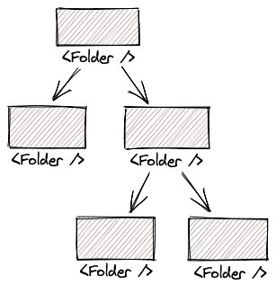

import Folders from './components/Folders'

I always had a hard time understanding recursive _functions_ when I stumbled upon them while learning to code. While I've got a better understanding today I don't use them much since they most often makes the code harder to read and reason about. One place I do use recursion however is when implementing recursive components.

In this post we'll touch on what recursion is, why recursive components is pretty cool for solving certain kind of problems and implement one that renders a folder structure like this:

<Folders />

> While we will use React to implement this component it's possible to build recursive components in all other modern JS frameworks too.

Before we get started, let's talk just a little bit about recursion. Feel free to skip ahead if you got a good grasp on it already.

But what is recursion really? [Wikipedia](<https://en.wikipedia.org/wiki/Recursion_(computer_science)>) defines it as _"a method of solving a problem where the solution depends on solutions to smaller instances of the same problem."_. In reality this often translates to problems where hierarchical structures like trees are involved.



So a recursive function is a function that invokes itself. In the case of traversing the above tree we would have a function `traverse(node)` that we'd invoke for the root of the tree, and then it would invoke itself for every child. So first `traverse(A)`, then `traverse(B)` and then those would invoke the function on their children and so on.

A recursive component on the other hand is a component that renders itself. One place where this comes in handy is when implementing features that deal with tree-like data, for example a nested menu, comments with hierarchy or as we'll implement in this post; a component that displays a folder structure.

The only important part of recursion we need to keep track of in our implementation of a recursive component is **the base case**. This is the case when we need to break out of the recursion and stop rendering ourself, otherwise we'd be stuck in an infinite loop. We'll get back to this is just a second.

Let's get to building the component. The data for the folder structure looks like this:

```json
{
  "name": "Desktop folder",
  "children": [
    {
      "name": "Pics",
      "children": [
        {
          "name": "Cats"
        }
      ]
    },
    {
      "name": "Important stuff",
      "children": [
        {
          "name": "Memes"
        },
        {
          "name": "Funny pics"
        }
      ]
    },
    {
      "name": "Blog post drafts"
    }
  ]
}
```

We'll start by creating a new component called `Folder` that will take a single prop called `folder`. It will render the name of the folder and then render itself (ie the same component) for each of it's children.

```jsx
import React from 'react'

export default function Folder({ folder }) {
  return (
    <li>
      {folder.name}
      {folder.children.map(child => (
        <Folder folder={child}></Folder>
      ))}
    </li>
  )
}
```

The one thing missing from this is that we need to identity our base case so that we can break out of the recursion. In our case this will be when the folder has no children, or in other words, when it's a _leaf_ in our tree. Let's add a conditional that checks just this.

```jsx
import React from 'react'

export default function Folder({ folder }) {
  const isLeaf = !folder.children

  return (
    <li>
      {folder.name}
      {!isLeaf &&
        folder.children.map(child => <Folder folder={child}></Folder>)}
    </li>
  )
}
```

Finally we render the `<Folder />` component somewhere:

```jsx
<ul>
  <Folder folder={data}></Folder>
</ul>
```

And that's it! You've just created a component that recursively renders itself until it reaches its base case. If you'd like to you can now add some better styling, expand/collapse buttons or try implementing it for something like a comment structure. You can find the complete source to the example at the top in this [CodeSandbox](https://codesandbox.io/s/mutable-firefly-tnjfs?fontsize=14&hidenavigation=1&theme=dark).

Thanks for reading! 🙌
