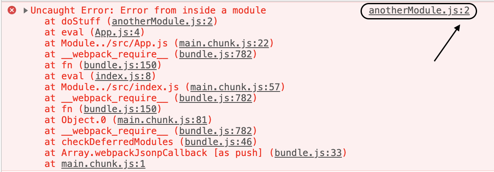
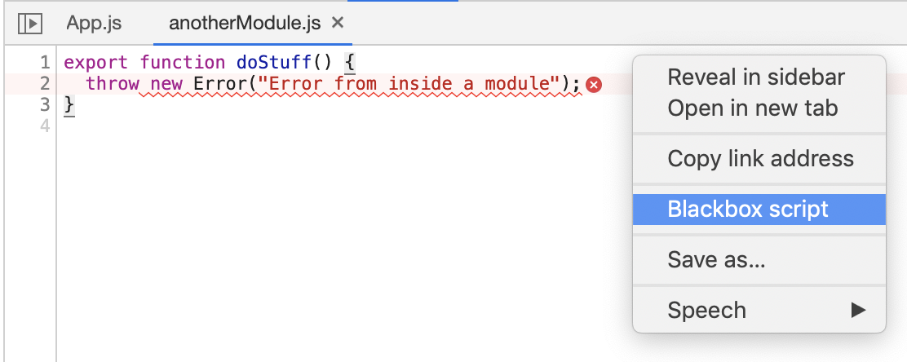
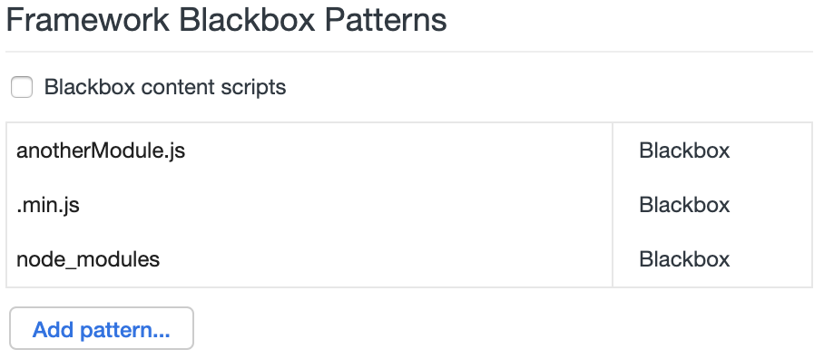
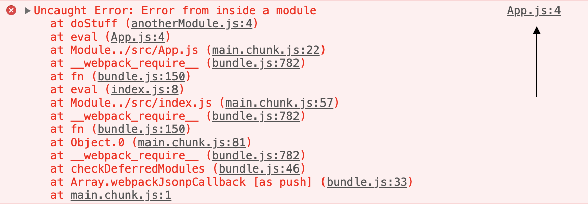
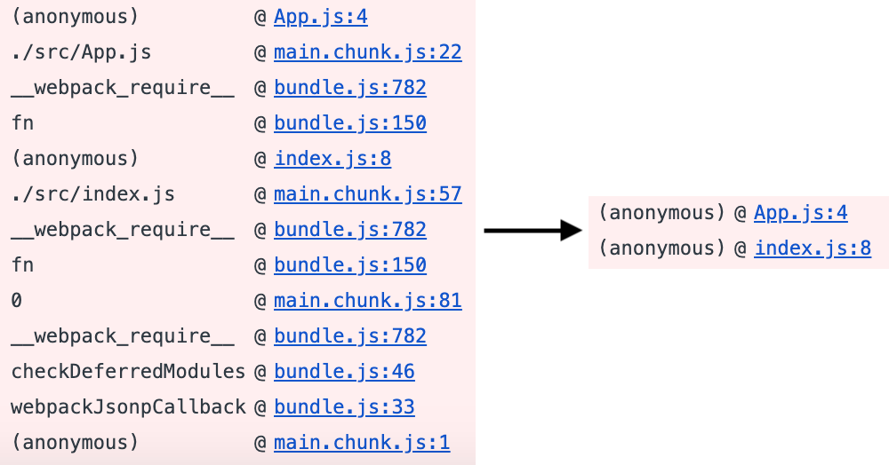

Most developer tools in modern browsers today support a feature called blackboxing. It's a tool used to denote certain source files for the debugger so they can route around it. You could for example use it to improve the stack traces of your errors or avoid stepping into framework source code.

Let's start by looking at a simplified example of an improved stack trace and error. Imagine we have a React application with a single component (`App.js`) that invokes a function from a third party library (`anotherModule.js`). If the third party library would throw an error we would get a stack trace pointing to the line inside the library that was responsible for the error.

You might have experienced this problem yourself with an error pointing to an obscure line in `react.min.js`, `angular.min.js` or any other framework source.

### Blackbox a source file

> These examples use Chrome DevTools but you also blackbox files in [Firefox](https://developer.mozilla.org/en-US/docs/Tools/Debugger/How_to/Black_box_a_source).

You can blackbox a file in two ways, either by opening and right clicking the file in the source panel or in the settings panel. If you right click inside the source of the file when you've opened it in the source panel you'll get the option to blackbox it.

What actually happens when you select this option is that the file is added to a list of patterns that should be blackboxed. If we look in the DevTools settings (`F1`) and under Blackboxing you should find your source file listed. This is the other place you can add source files to blackbox, but most importantly you can also add patterns. For example `.min.js` to blackbox all minified files or `node_modules` to blackbox all files in the node_modules folder.

So when the third-party `anotherModule.js` is blackboxed, DevTools now points to our own source file instead of the library source.

Note that this example is very contrived, so in this case we could have for example looked at the error and seen that our source was the second file in the trace but in a more realistic scenario this might be harder.

### Improved stack traces

Talking about stack traces, they are also improved when blackboxing scripts. On the left is a stack trace from the above React app, and to the left is the same stack trace with the `main.chunk.js` and `bundle.js` files blackboxed.

### Stepping through blackboxed code

Finally, as briefly mentioned in the beginning of this post, blackboxing also means that when you step over/into/out of any code with the debugger you will automagically skip the blackboxed scripts. This means no more suddenly ending up in `angular.min.js` with no idea where or who you are any more! 😍

## Conclusion

To summarize, by blackboxing source files you will receive errors and logs with relevant source lines, stack traces will by more succinct and when stepping through code you will only end up in the relevant sources.

Let me know what you think of the article! Do you have any other productivity tips when using the developer tools?
